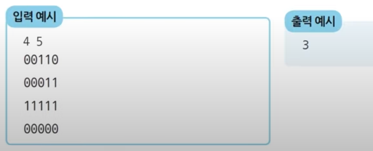

| 시간 제한 | 메모리 제한 | 
|:-----:|:------:|
|  1초   | 128 MB |

## 입력조건
- 첫 번째 줄에 얼음 틀의 세로 길이 N과 가로 길이 M이 주어집니다. (1= N, M (= 1,000)
- 두 번째 줄부터 N + 1 번째 줄까지 얼음 틀의 형태가 주어집니다.
- 이때 구멍이 뚫려있는 부분은 0. 그렇지 않은 부분은 1입니다.

## 출력 조건
- 한 번에 만들 수 있는 아이스크림의 개수를 출력합니다.

