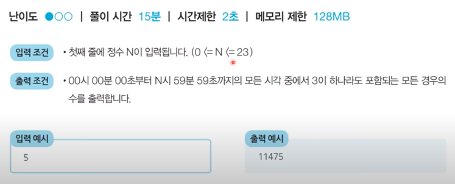

# 난이도 v00 | 풀이 시간 15분 | 시간제한 2초 | 메모리 제한 128MB
## 입력조건
첫째 줄에 정수 No 입력됩니다. (O <=N <= 23)
## 출력 조건
00시 00분 00초부터 N시 59분 59초까지의 모든 시각 중에서 30 하나라도 포함되는 모든 경우의
수를 출력합니다.
### 입력 예시
    5
### 출력 예시
    11475
 

